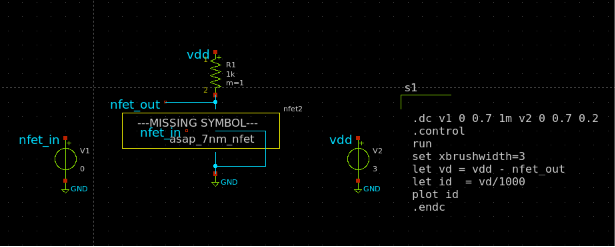
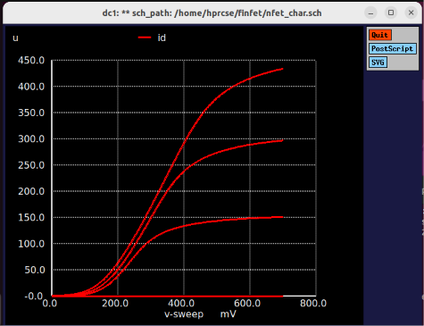

# 1. FET Characteristics — NMOS & PMOS DC Characterization

**Technology:** ASAP7 7nm FinFET | **Tool:** Ngspice + Xschem | **Analysis:** `.dc` sweep

---

## Objective

This module characterizes the fundamental DC electrical behavior of the `asap_7nm_nfet` and `asap_7nm_pfet` transistors from the ASAP7 PDK. The goal is to extract key figures of merit — drain current families, threshold voltage, subthreshold slope, DIBL, and on/off current ratio — directly from SPICE simulation using the BSIMCMG v107 compact model.

---

## Circuit Description

### NMOS Characterization Testbench (`nfet_char.sch` / `nfet_char.spice`)



The testbench topology is a **single-transistor drain-current measurement** configuration. A sense resistor (R1 = 1 kΩ) sits between the drain-supply node `vdd` and the drain terminal `nfet_out`; the transistor source and bulk are both tied to `GND`. Two independent voltage sources sweep the bias conditions:

```
VDD (V2) ──┬── R1 (1kΩ) ──┬── D
            │               │
            │          Xnfet2 (asap_7nm_nfet)
            │           L=7nm, nfin=14
            │               │
           GND     G ── V1  S,B ── GND
```

**Drain current derivation:**
```spice
let vd = vdd - nfet_out     ; voltage drop across R1
let id = vd / 1000          ; Id = Vr / R (Ohm's law), unit: Amperes
```

**Transistor sizing:**
- Gate length: `l = 7e-9` m (7 nm — the physical channel length)
- Number of fins: `nfin = 14`
- Effective width: W_eff = 14 × (2 × 32 nm + 6.5 nm) = **987 nm**

---

## SPICE Analyses

### Analysis 1 — Id-Vds Output Characteristics (Family of Curves)

```spice
.dc v1 0 0.7 1m  v2 0 0.7 0.2
```

- **Inner sweep:** `V1` (Vgs) steps from **0 V → 0.7 V** in **1 mV** increments
- **Outer sweep:** `V2` (Vds) steps from **0 V → 0.7 V** in **0.2 V** steps → yields **4 Id-Vds curves** at Vgs = {0, 0.2, 0.4, 0.6} V (and at 0.7 V)
- **Observable:** Triode region (linear), onset of saturation (pinch-off knee), saturation current level, channel length modulation (finite output impedance slope in saturation)

Expected operating regions at `nfin=14`, `l=7nm`, `VDD=0.7V`:
- **Linear region:** Vds < Vgs − Vth (approximately 0 → 0.3 V for Vgs = 0.7 V)
- **Saturation:** Vds ≥ Vgs − Vth; Id reaches plateau modified by CLM parameter `pclm = 0.05`
- **Peak Id (estimated):** ~0.4–0.6 mA at Vgs = Vds = 0.7 V for nfin=14

### Analysis 2 — Id-Vgs Transfer Characteristic (Subthreshold & Above-Threshold)

A separate sweep (`v2` fixed, `v1` swept) produces the Id-Vgs characteristic:

```spice
.dc v1 0 0.7 1m
* Run at vds = 0.7V (saturation) and vds = 0.05V (linear) for DIBL extraction
```

- **Plot on linear scale:** Above-threshold transconductance, Vth extraction by maximum-gm method
- **Plot on log scale:** Subthreshold slope (SS = dVgs / d(log₁₀ Id)), off-state leakage floor, GIDL onset
- **DIBL extraction:** ΔVth between Vds = 0.05 V and Vds = 0.7 V, normalized by ΔVds

**Key model parameters controlling subthreshold behavior:**
| Parameter | NMOS | Description |
|---|---|---|
| `eta0` | 0.07 | DIBL coefficient |
| `dsub` | 0.35 | Subthreshold DIBL slope |
| `cdsc` | 0.01 | Channel-to-drain/source coupling capacitance |
| `dvt0` | 0.05 | Short-channel threshold voltage roll-off |
| `dvt1` | 0.47 | First subthreshold swing coefficient |

**Expected subthreshold slope:** ~70–80 mV/decade (approaching the 60 mV/dec thermal limit at room temperature)

### Analysis 3 — PMOS Characterization (`pfet_char.spice`)

The PMOS testbench mirrors the NMOS setup with inverted bias polarities:

- `V2` supplies −0.7 V → 0 V (Vsd sweep from 0 → 0.7 V)
- `V1` steps the gate voltage to generate the Id-Vsd family
- PMOS uses `phig = 4.9278 eV` (higher work function) vs NMOS `phig = 4.2466 eV`
- Lower `u0 = 0.0237 m²/V·s` vs NMOS `0.0303` reflects the hole mobility deficit (~78% of NMOS mobility)

---

## Key BSIMCMG Model Parameters — Reference Card

```
NMOS Gate Work Function:   phig = 4.2466 eV
PMOS Gate Work Function:   phig = 4.9278 eV
Fin thickness (tfin):       6.5 nm
Fin height (hfin):         32.0 nm
Fin pitch (fpitch):        27.0 nm
Gate-oxide thickness (eot): 1.0 nm
NMOS low-field mobility:    u0 = 0.0303 m²/V·s
PMOS low-field mobility:    u0 = 0.0237 m²/V·s
NMOS saturation velocity:  vsat = 70000 m/s
PMOS saturation velocity:  vsat = 60000 m/s
```

---

## Running the Simulation

```bash
# 1. Set the correct OSDI path in nfet_char.spice (line: pre_osdi ...)
# 2. Run in batch mode
ngspice -b nfet_char.spice

# Or interactive (opens waveform plot windows)
ngspice nfet_char.spice
```

---

## Simulation Waveforms & Plots

> **Placeholder section.** Run the `.spice` decks locally, export waveform captures as PNG, and place them at the paths below.

### Id-Vds Output Characteristics — NMOS (Family of Curves)



*Expected: Overlaid Id-Vds curves for Vgs = 0.2, 0.4, 0.6, 0.7 V. Clear triode-to-saturation knee visible near Vds = Vgs − Vth. Saturation current increases with Vgs.*

---

