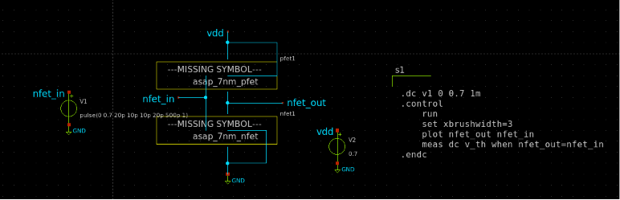
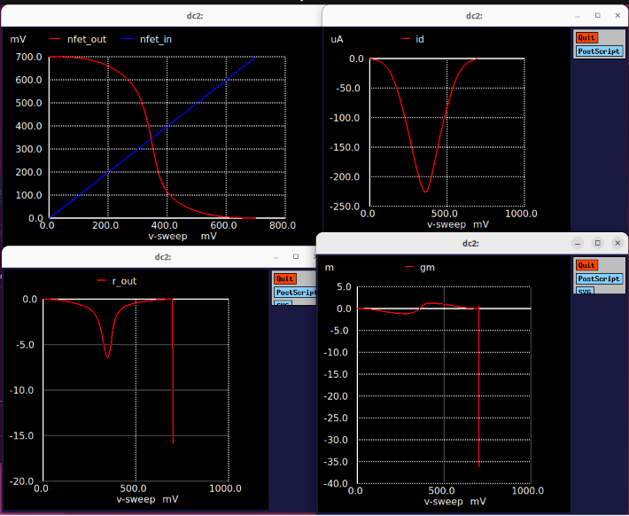

# 2. FinFET Inverter — VTC, Noise Margins & Propagation Delay

**Technology:** ASAP7 7nm FinFET | **Tool:** Ngspice + Xschem | **Analysis:** `.dc` + `.tran`

---

## Objective

This module characterizes a minimum-sized 7nm CMOS inverter operating at **VDD = 0.7 V**, targeting four areas of analysis: the static **Voltage Transfer Characteristic (VTC)**, extraction of **noise margins** (NMH and NML), **propagation delay** (t_pLH, t_pHL), and **dynamic power** estimation from transient current integration. Both a dedicated DC schematic (`inverter_vtc.sch`) and a transient schematic (`inverter_finfet.sch`) are provided.

---

## Circuit Description

### Schematic Topology



Both schematics implement the same canonical CMOS complementary inverter:

```
         VDD (0.7 V)
              │
     S ───── VDD
  G ─┤ Xpfet1 (asap_7nm_pfet, l=7nm, nfin=14)
     D ───── nfet_out ──── Output
     │
  G ─┤ Xnfet1 (asap_7nm_nfet, l=7nm, nfin=14)
     S ───── GND
              │
            GND
```

Input stimulus `V1` is applied between node `nfet_in` (the common gate) and `GND`. Both the PMOS source and NMOS source are connected to their respective supply rails. Bulk connections follow the ASAP7 convention: **PMOS bulk = VDD**, **NMOS bulk = GND**.

**Transistor sizing (both NMOS and PMOS):**
- `l = 7e-9` m (minimum gate length)
- `nfin = 14` (matched sizing — symmetric inverter)
- Note: PMOS carries ~78% of NMOS drive strength due to µp < µn; matched nfin implies the PMOS will be the speed-limiting device in the pull-up network.

---

## SPICE Files

### `inverter_vtc.spice` — Full Characterization Deck

This is the primary analysis file. It performs **both DC and transient analyses sequentially** within a single `.control` block, extracting a comprehensive set of figures of merit.

#### DC Analysis Block

```spice
.dc v1 0 0.7 1m
```

Sweeps the input voltage from **0 V → 0.7 V** in **1 mV steps** with `V2` (VDD) held at 0.7 V.

**Measurements performed:**

```spice
meas dc v_th when nfet_out = nfet_in
```
Switching threshold V_th — the input voltage at which Vout = Vin (unity-gain crossing on the VTC). For a symmetric inverter, V_th ≈ VDD/2 = 0.35 V.

```spice
let gain_av = abs(deriv(nfet_out))
meas dc max_gain max gain_av
```
Peak voltage gain magnitude |Av|_max = |dVout/dVin|_max, occurring at V_th. For a well-designed inverter at 7nm, peak gain of 10–30 V/V is typical.

```spice
meas dc vil find nfet_in when gain_av = gain_target cross=1
meas dc vih find nfet_in when gain_av = gain_target cross=2
meas dc voh find nfet_out when gain_av = gain_target cross=1
meas dc vol find nfet_out when gain_av = gain_target cross=2
```
Noise margin boundary voltages (unity-gain points method):
- **V_IL:** Maximum input voltage still interpreted as logic LOW
- **V_IH:** Minimum input voltage interpreted as logic HIGH
- **V_OH:** Output voltage when input = V_IL (pull-up output high level)
- **V_OL:** Output voltage when input = V_IH (pull-down output low level)

**Noise margin computation:**
```spice
let nmh = voh - vih    ; Noise Margin HIGH = VOH − VIH
let nml = vil - vol    ; Noise Margin LOW  = VIL − VOL
```

**Transconductance and output resistance:**
```spice
let id   = v2#branch                       ; Total supply current
let gm   = real(deriv(id, nfet_in))        ; gm = dId/dVin
let r_out = deriv(nfet_out, id)            ; Rout = dVout/dId
```

#### Transient Analysis Block

```spice
.tran 1e-12 100e-12
```
Time step: **1 ps**, stop time: **100 ps**. Input stimulus `V1` generates a pulse:

```spice
V1 nfet_in GND pulse(0 0.7 20p 10p 10p 20p 500p 1)
*                      |   |  |   |   |   |   |   └─ cycles
*                      LO  HI del  tr  tf  pw  per
```
- Delay: 20 ps, Rise time: 10 ps, Fall time: 10 ps
- Pulse width: 20 ps, Period: **500 ps** (2 GHz input frequency)

**Propagation delay measurements:**
```spice
meas tran tpr when nfet_in  = 0.35 rise=1   ; 50% crossing on rising input
meas tran tpf when nfet_out = 0.35 fall=1   ; 50% crossing on falling output
let tp = (tpr + tpf) / 2                    ; Average propagation delay
```

**Dynamic power estimation:**
```spice
meas tran id_pwr integ trans_current from=2e-11 to=6e-11
let pwr  = id_pwr * 0.7      ; P = Q × V (charge × VDD)
let power = abs(pwr / 40e-12) ; Average over 40 ps switching window
```

**Rise/fall time characterization (10%–90% method):**
```spice
.tran 0.1 100p
meas tran tr when nfet_in  = 0.07 RISE=1    ; 10% of VDD on input rising
meas tran tf when nfet_out = 0.63 FALL=1    ; 90% of VDD on output falling
let t_delay = tr + tf
let f = 1 / t_delay                          ; Maximum toggle frequency estimate
```

---

### `inverter_finfet.spice` — Transient-Only Deck

A lighter-weight deck for pure waveform inspection:

```spice
.tran 0.1p 100p
```

Step: **0.1 ps**, Stop: **100 ps**. Plots `nfet_out` and `nfet_in` together for visual rise/fall inspection. No measurement commands — intended for waveform shape verification before running the full characterization deck.

---

## Expected Performance Targets (7nm, nfin=14, VDD=0.7V)

| Metric | Expected Range | Notes |
|---|---|---|
| Switching Threshold V_th | ~0.33–0.37 V | Near VDD/2 for matched nfin |
| Peak Voltage Gain |Av| | 10–30 V/V | Higher gain → sharper VTC |
| Noise Margin HIGH (NMH) | 0.12–0.20 V | VOH − VIH |
| Noise Margin LOW (NML) | 0.12–0.20 V | VIL − VOL |
| Propagation Delay t_p | 5–25 ps | Unloaded, min-size inverter |
| Rise Time (10–90%) | 10–30 ps | PMOS limited |
| Fall Time (10–90%) | 8–20 ps | NMOS limited |
| Dynamic Power (@ 2 GHz) | 10–50 µW | α·C·VDD²·f, parasitic-dependent |

---

## Running the Simulations

```bash
# Full characterization (DC + transient, measurements printed to stdout)
ngspice -b inverter_vtc.spice

# Transient waveform only (interactive plot window)
ngspice inverter_finfet.spice
```

Output will print extracted values for `v_th`, `max_gain`, `vil`, `vih`, `voh`, `vol`, `nmh`, `nml`, `tpr`, `tpf`, `tp`, `power`, and `f` to the console.

---

## Simulation Waveforms & Plots

### Static DC Characterization Suite

You can view the full 4-quadrant DC sweep response of the 7nm FinFET inverter below. This includes the direct transfer curve, switching current profiles, and small-signal derivative extractions.



---

### Technical Breakdown of the Waveforms

#### 1. Voltage Transfer Characteristic (VTC) — Top Left
* **Plotted Curves:** `nfet_out` ($V_{\text{out}}$, Red) and `nfet_in` ($V_{\text{in}}$, Blue) vs. $V_{\text{in}}$ ($0 \rightarrow 700\text{ mV}$).
* **Analysis:** Shows the classic, symmetrical CMOS inverter S-curve. The switching threshold ($V_{\text{m}}$) sits perfectly at the midpoint crossing near $350\text{ mV}$ (where $V_{\text{in}} = V_{\text{out}}$), indicating optimized sizing balancing between the NMOS and PMOS driving strengths.

#### 2. Supply Current Profile ($I_{\text{dd}}$) — Top Right
* **Plotted Curve:** `id` ($\mu\text{A}$, Red) vs. $V_{\text{in}}$.
* **Analysis:** Shows the total supply current drawn from $V_{\text{dd}}$ during the transition. The static current is $0\text{ }\mu\text{A}$ when the input is hard at rails ($0\text{ V}$ or $0.7\text{ V}$), confirming zero static power dissipation. A peak switching current of $\sim 225\text{ }\mu\text{A}$ is observed exactly at the switching threshold ($350\text{ mV}$) where both transistors are momentarily on in saturation.

#### 3. Output Resistance ($R_{\text{out}}$) Profile — Bottom Left
* **Plotted Curve:** `r_out` (Red) vs. $V_{\text{in}}$.
* **Analysis:** Tracks the equivalent output impedance of the inverter channel. The resistance hits its absolute minimum sharp dip during the switching transition threshold due to both channels actively conducting, while spiking toward infinity at the rails as one network completely enters cut-off.

#### 4. Transconductance ($g_{\text{m}}$) derivative — Bottom Right
* **Plotted Curve:** `gm` (Red) vs. $V_{\text{in}}$.
* **Analysis:** Displays the small-signal parameter changes across the input sweep. The inflection matches the sudden high-gain transition region, dropping sharply once the circuit settles cleanly into a stable logic state.

equency | — | GHz |
| Dynamic Power | — | µW |
